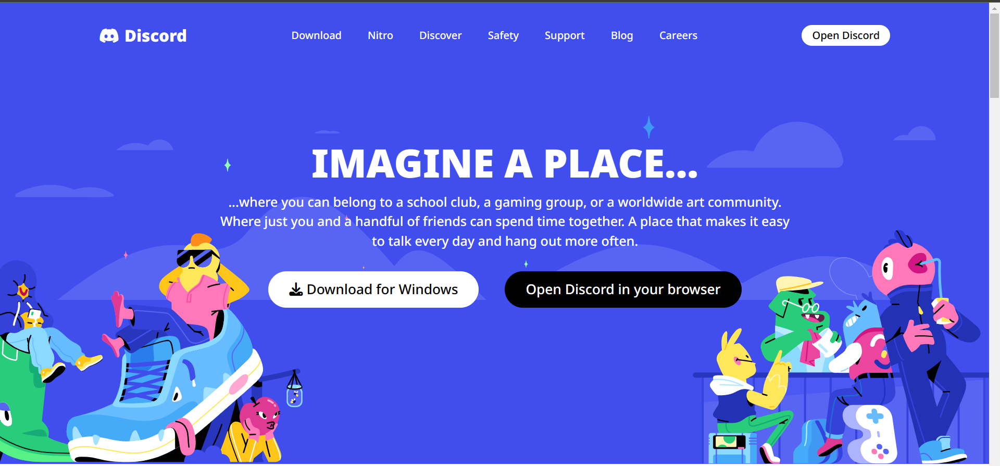
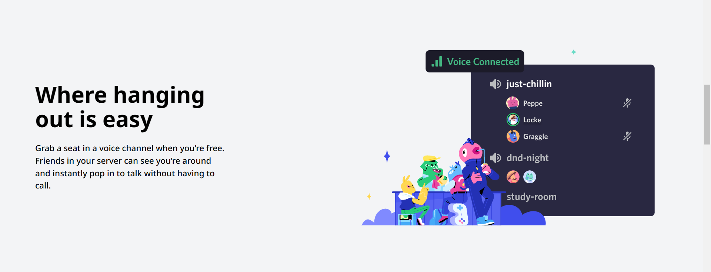
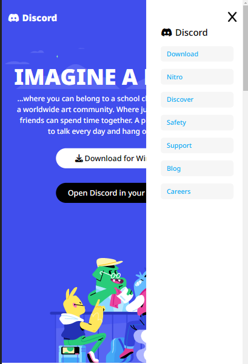
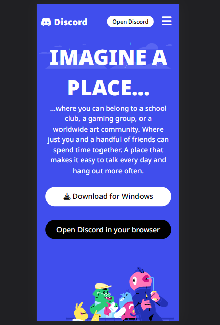
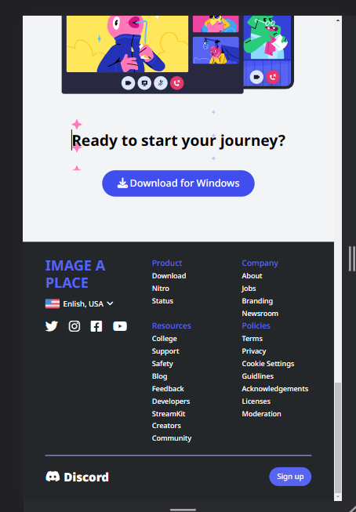

# Discord Clone 

Live Link:- [Click Here...](https://amarjeet-discord-clone.netlify.app/)

### Technology Used  🧑‍💻
  - ` HTML `
  - ` Tailwind CSS `
  - ` JavaSript `

## 👨‍💻 About Developer 👨‍💻

Hey I am Amarjeet Kumar, Fullstack Javascript Developer. Very much eager to explore and develop scalable, user friendly, robust applications. 

[Portfolio](https://amarjeet-portfolio.netlify.app/)

[Linkdin](https://www.linkedin.com/in/amarjeet-kumar-46b79b236/)

[Instagram](https://www.instagram.com/amarkumar.aaryan.5/)

Web View 🖥️

## ⏳ Meta Information ⏳
 - Time taken: 6 hours

## 😃 Thanks for spending your valuable time on this project 😃 